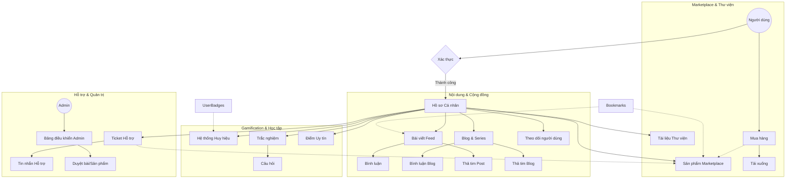

# Sơ đồ hoạt động và Cấu trúc Dữ liệu CodeConnect Hub

Tài liệu này cung cấp cái nhìn tổng quan về cách các thành phần trong hệ thống tương tác với nhau và chi tiết các trường dữ liệu trong Database.

## 1. Sơ đồ Luồng hoạt động (System Flowchart)

---

## 2. Chi tiết các Bảng Dữ liệu (Database Schema)

Dưới đây là danh sách đầy đủ các bảng và các trường dữ liệu tương ứng:

### 👤 Người dùng & Profile
| Bảng | Trường dữ liệu |
|:---|:---|
| **profiles** | `id` (PK), `username`, `display_name`, `avatar_url`, `bio`, `location`, `website`, `github_username`, `reputation`, `followers_count`, `following_count`, `skills`, `created_at`, `updated_at` |
| **follows** | `id`, `follower_id` (FK), `following_id` (FK), `created_at` |

### 📝 Nội dung (Posts & Blogs)
| Bảng | Trường dữ liệu |
|:---|:---|
| **posts** | `id`, `user_id` (FK), `content`, `image_url`, `tags`, `likes_count`, `comments_count`, `views_count`, `is_published`, `created_at` |
| **blog_posts** | `id`, `user_id`, `title`, `slug`, `excerpt`, `content`, `thumbnail_url`, `category`, `series_id` (FK), `is_published`, `views_count`, `likes_count` |
| **series** | `id`, `user_id`, `title`, `slug`, `description`, `thumbnail_url`, `is_published`, `status` |
| **comments** | `id`, `post_id` (FK), `user_id`, `content`, `parent_id` (Self FK), `likes_count` |
| **bookmarks** | `id`, `user_id`, `post_id`, `product_id`, `blog_post_id`, `created_at` |

### 💰 Marketplace & Kinh doanh
| Bảng | Trường dữ liệu |
|:---|:---|
| **products** | `id`, `user_id`, `name`, `description`, `price`, `original_price`, `demo_url`, `tech_stack`, `category`, `downloads_count`, `rating`, `is_published` |
| **purchases** | `id`, `user_id` (Buyer), `product_id`, `price_paid`, `download_count`, `purchased_at` |
| **resources** | `id`, `user_id`, `title`, `description`, `type` (pdf, code...), `file_url`, `is_premium`, `price`, `downloads_count` |

### 🎖️ Gamification & Thử thách
| Bảng | Trường dữ liệu |
|:---|:---|
| **badges** | `id`, `name`, `description`, `icon`, `type` (gold, silver...), `points_required` |
| **user_badges** | `id`, `user_id`, `badge_id` (FK), `awarded_at` |
| **quizzes** | `id`, `title`, `description`, `category`, `difficulty`, `questions_count`, `created_by` |
| **quiz_questions** | `id`, `quiz_id`, `question`, `options` (JSON), `correct_answer`, `explanation` |

### 🆘 Hỗ trợ khách hàng
| Bảng | Trường dữ liệu |
|:---|:---|
| **tickets** | `id`, `user_id`, `product_id`, `subject`, `status` (open, resolved...), `priority`, `created_at` |
| **ticket_messages**| `id`, `ticket_id`, `user_id`, `message`, `is_staff_reply`, `created_at` |

---

> [!NOTE]
> Hệ thống sử dụng **Supabase Row Level Security (RLS)** để đảm bảo quyền truy cập dữ liệu:
> - User bình thường chỉ thấy dữ liệu công khai.
> - Admin có quyền quản trị toàn bộ qua Bảng điều khiển Console.
